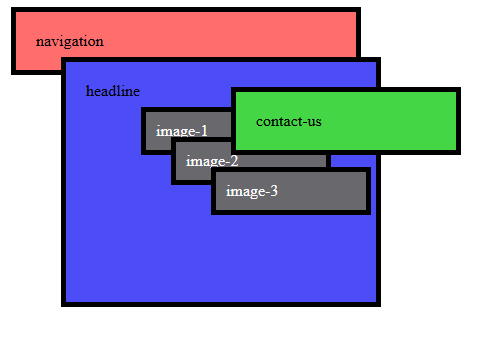
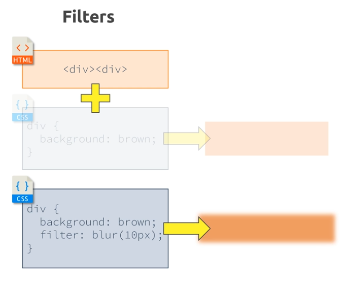

My notes from the course.

Look for `KLUDGE` in the source code for useful hacks.

# Fonts
- Serif: extending features at the end of strokes

# DevTools Styles tab
Styles are listed from most specific (top) to least specific (bottom).

Click on keyword "inherited" to see the true value, which can include ~~value~~.

# Naming Conventions
Look into `B.E.M.` aka `block, element, modifier`

Format is: `<block>__<element>--<modifier>`

Example:
```
  plan__item--highlighted

  /* plan is the logical container
     item is the element
     highlighted is the modifier
  */
```

# Selectors

## Universal 
```
<style>
  * { ... }
<style>
```

## Element
```
<style>
  body { ... }
<style>
...
<body>
...
</body>
```

## Class
```
<style>
  .post { ... }
</style>
...
<body>
  <p class="post">...</p>
</body>
```
 
## Attribute
 ```
 <style>
  [disabled] { ... }
</style>
...
<form>
  <button disabled>...</button>
</form>
 ```

## ID
 ```
 <style>
  #name-input { ... }
</style>
...
<form>
  <input id="name-input">
</form>
 ```

# Combinators
## Adjacent Sibling aka Next Sibling
* Elements share the same parent.
* Second element comes __immediately__ after first element.

```
<style>
  h2 + p { 
    color: red;
  }
<style>

<div>
  <h2>Not applied</h2>
  <p>CSS applied</p>
  <h2>Not applied</h2>
  <h3>Not applied</h3>
  <p>Not applied</p>
  <h2>Not applied</h2>
  <p>CSS applied</p>
</div>
```
## General Sibling aka Subsequent Sibling
This is more flexible than _Adjacent Sibling_.

* Elements share the same parent
* Second elements comes after first element

```
<style>
  h2 ~ p { 
    color: red;
  }
<style>

<div>
  <h2>Not applied</h2>
  <p>CSS applied</p>
  <h2>Not applied</h2>
  <h3>Not applied</h3>
  <p>CSS applied</p>
</div>
```

## Child
* Second element is a _direct child_ of first element.

```
<style>
  div > p { 
    color: red;
  }
<style>
<div>
  <div>Not applied</div>
  <p>CSS applied</p>
  <div>Not applied</div>
  <article>
    <p>Not applied</p>
  </article>
  <p>CSS applied</p>
</div>
```

## Descendant
* Second element is a descendant of the first element.

```
<style>
  div p { 
    color: red;
  }
<style>

<div>
  <div>Not applied</div>
  <p>CSS applied</p>
  <div>Not applied</div>
  <article>
    <p>CSS applied</p>
  </article>
  <p>CSS applied</p>
</div>
```

# Specificity of Selectors
TODO: need to make sure this is correct

1. `!important`
1. inline style (labeled `element.style` in devtools)
1. `#ID`
1. `.class`, `:pseudo-class` and `[attribute]`
1. `<element>` and ::pseudo-element, `*` selector, browser defaults
1. inherited styles

__TODO: Where do combinators (Eg multiple selectors) go in this list?__

Conflicts are resolved by looking at the order in file, where last style wins.  Eg if you an element has both a `.class` and an `[attribute]` with styles, then the last one in the file will win.

# Performance
* ID selector and class selector 
* ... 
* certain combinators? (TODO: clarify)
* `*` selector

# Box Model
From inside to outside:
* content - the data to display within an HTML element.
* padding - "inside" space between the data and the element border.
* border - surrounds an element
* margin - "outside" space between the element and the rest of the DOM.

# Margin Collapsing
  The top and bottom margins of blocks are sometimes combined (collapsed) into a single margin whose size is the largest of the individual margins (or just one of them, if they are equal), a behavior known as margin collapsing. Note that the margins of floating and absolutely positioned elements never collapse.

From https://developer.mozilla.org/en-US/docs/Web/CSS/CSS_box_model/Mastering_margin_collapsing

# Shorthand properties
* Border: width style color, Eg 2px dashed orange
* Margin: top right bottom left, Eg 5px 10px 5px 10px 
* Margin: top & bottom left & right, Eg 5px 10px
* Margin: all, Eg 8px

# Height and Width
Pixel values are aboslute and do not depend on the parent element.

_Percentage_ values are based on the space within the parent element.  Many elements will be sized based on their content.  That leads to a width or height of 100% having no effect.

To make things take up more height, you must size from the top HTML element all the way down to the target element.
```
  <html style="height: 100%;">
    <body style="height: 100%;">
      <main style="height: 100%;">
        <!-- this will be 100% of page -->
        <div style="height: 100%;">
```

# Box Sizing
By default, Height and Width set the dimensions of the content, with padding, border and margin being additive to the total size of the area.  This is called _content_box_ sizing.

You can change this via `box-sizing` style. 

# Display Property
* none: element is not visible but present in the DOM.  It does not block a position in the layout.
* block
* inline
* inline-block: render like an inline element (Ie renders next to adjacent elements) with additional box properties like x-top, x-bottom and width, height available. TODO: confirm all box properties are true.

There is also `visibility: none` which will hide the element but the element will continue to block it's position in the layout.

**Inline Block is sensative to whitespace in HTML source** 

# Pseudo Things
Classes - `:class_name` - define a style for a _specific state_ of an element, Eg hover, read-only, first-child, not.
Element - `::element_name` - define a style for a _specific part_ of an element, Eg before, after, first-letter.  [Pseudo-elements act as if you had added a whole new element to the DOM, and enable you to style that.](https://developer.mozilla.org/en-US/docs/Learn_web_development/Core/Styling_basics/Pseudo_classes_and_elements#summary)

# Tricks
* Set all parent elements to `width: 100%;` to allow child element to have a specific height.
* Set left/right margin to auto `margin: 0 auto;` to center an element horizontally.  This does not work for vertical alignment.
* Create circle by setting `height` and `width` to the same value and `border-radius: 50%`

# Positioning
Applies to block and inline elements.

How should the element be positioned Aka __Position Context__
* static (default)
* absolute
* relative
* fixed
* sticky

Where should the element be placed relative to the position context
* top
* right
* bottom
* left

__Note__: top/right/bottom/left will only have effect when the position property is set to a non-default value (Ie not `static`).

### Fixed
Element is taken out of the document flow.

* Without top/right/bottom/left the position context is the parent element.
* With top/right/bottom/left the position context is the _viewport_.

### Absolute
Element is taken out of the document flow.

* If no ancestors have a position applied, then the position context is the `<html>` element.
* If ancestors have a position applied, then the position context is the _closest ancestor with a position property_.

### Relative
Element remains in the document flow.

* Positioning context is the _element_ itself.
* Top/right/bottom/left adjusts relative to element's current position.

__Problem__: You can move the element outside of it's parent element.  Use `overflow: hidden;` in the parent element to ensure the element is not displayed when it goes outside the bounds of parent.  __Caveat__: you cannot apply `overflow: hidden;` to `<body>` as the default behavior in CSS says that it will instead be applied to `<html>`, which will ensure any child-elements of body will NOT be hidden.  To get around this: apply `overflow: hidden;` or `overflow: auto;` to `<html>` and apply `overflow: hidden;` to `<body>`.

### Sticky
* The element starts as `relative` when there are no distances set.
* If you set a distance then the position context is either the _viewport_ or _another element_.  Once the distance is reached, the element behaves as `fixed`.
* If the element goes outside of its parent content area then it becomes hidden.

From MDN: ... a sticky element "sticks" to its nearest ancestor that has a "scrolling mechanism" (created when `overflow` is `hidden`, `scroll`, `auto`, or `overlay`), even if that ancestor isn't the nearest actually scrolling ancestor.

__TODO__ need more details here.  Course coverage not great.

## z-index
* default value is `auto` which is equal to `0`.
* Will not take effect unless you've changed position property to a non-default value (Ie not `static`).
* When there are multiple elements with same z-index, the last element in the HTML source file wins and is displayed above the other elements.

## Stacking Context
Each z-index is evaluated within a `stacking context`.  By default the root element (`<html>`) establishes the initial stacking context.

A stacking context is defined by any element:
* element with position of `absolute` or `relative` and a `z-index` value other than `auto`.
* element with position of `fixed` or `sticky`.

The stacking context is used to evaulate z-index values of all child elements relative to each other.

In this example, `headline` has a z-index value, and `image-2` has a z-index value.  `image-2` cannot be below `headline` or above `contact-us` without making adjustments to its parent z-index value first.



# Backgrounds & Images

## background-size

`background-size: <height> <width>;` where height and width are:
* auto
* px
* %

`background-size: <keyword>;` where keyword is:
* cover - Scales the image (while preserving its ratio) to the smallest possible size to fill the container (that is: both its height and width completely cover the container), leaving no empty space.
* contain - Scales the image as large as possible within its container without cropping or stretching the image.

## background-position
For an image that does not fit into it's container, position defines where the cropping will occur.

`background-position: <x offset> <y offset>;` where offset
* px
* % - determines where to crop the image.  A value of `top = 50%` means that top and bottom will be cropped equally. Read more at https://developer.mozilla.org/en-US/docs/Web/CSS/background-position#regarding_percentages
* position keywords - center (sames as `50% 50%`) or left top (same as `0% 0%`)
* position and % or px values - Eg `left 10% bottom 20%`

X is evaluated relative to left and Y is evaluated relative to top.

## background-origin

Like box-sizing. TODO: more details

## background-clip

Overwrites background-origin. TODO: more details.

## background-attachment

Defines how image attaches (and scrolls) to the container or viewport.
 
Not used often.

## background shorthand

```
/*          image              position           /size  repeat    origin clip  */
background: url("freedom.jpg") left 10% bottom 20%/cover no-repeat border-box   ;
```

When a single value is used in the `origin clip` position then it's used for both properties as shown in the example above.

## images

* By default, the dimensions of the image will be used to render the image regardless of its parent element.
* __KEY__ If the parent element is an inline element, then using percent values for image height/width will have the same behavior (Ie ignored).  THe parent element dimensions are used.
* __KEY__ If the parent element is a block or inline-block element, then the parent container size controls the image size.


Position and sizing of an img is not as flexible as background-image, but background-image should only be used for 'background' images due to accessibilty concerns.


# box-shadow
Args:
* X
* Y
* blue
* spread
* color
  * rgb and the 4th value is opacity

```
/*          X     Y     blur  spread   color                    */
box-shadow: 2px   2px   2px    2px   rgba(0, 0, 0, 0.5);
/*                                                   ^opacity   */
```

See https://developer.mozilla.org/en-US/docs/Web/CSS/CSS_backgrounds_and_borders/Box-shadow_generator

# Gradients
* Gradients are treated as images.
* My notes are light - read MDN instead if you need it.

## Linear
* Use builtin `linear-gradient()` function.

Examples:
```
  background-image: linear-gradient(30deg, red, blue);
  background-image: linear-gradient(to left bottom, red, blue);
  background-image: linear-gradient(180deg, red, blue, green, yellow, orange);
  background-image: linear-gradient(360deg, red, transparent);
  /*                                        red ends after 70% */
  background-image: linear-gradient(180deg, red 70%, blue, grey);
  /*                                        blue ends after 80% */
  background-image: linear-gradient(180deg, red 70%, blue 80%, grey);
  /*                                        blue ends after 60% which makes a hard edge */
  background-image: linear-gradient(180deg, red 70%, blue 60%, grey);
```

* Elipse can have it's size (width, height) adjusted.  See circle examples.

## Radial
* Use builtin `radial-gradient()` function.
* by default, makes ellipse.  use optional first arg to make a circle.

Examples:
```
  background-image: radial-gradient(red, blue);
  background-image: radial-gradient(red, blue, green);
  /*                                shape                         */
  background-image: radial-gradient(circle, red, blue, green);
  /*                                          shape start 'at top'
                                               v                  */
  background-image: radial-gradient(circle at top, red, blue, green);
  /*                                ditto      X  Y               */
  background-image: radial-gradient(circle at 20% 50%, red, blue, green);
  /*                                       size                   */
  background-image: radial-gradient(circle 20px at 20% 50%, red, blue, green);
```

## Stacking Backgrounds
* Only 1 background-color can be used.  It will be last one listed in the style.
* Multiple background-image styles can be used.

# Filter
* grayscale()

 

