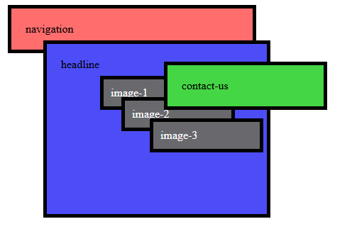
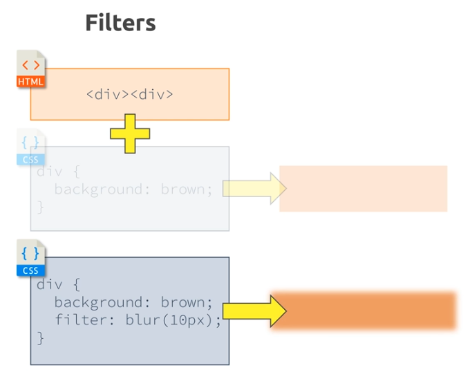
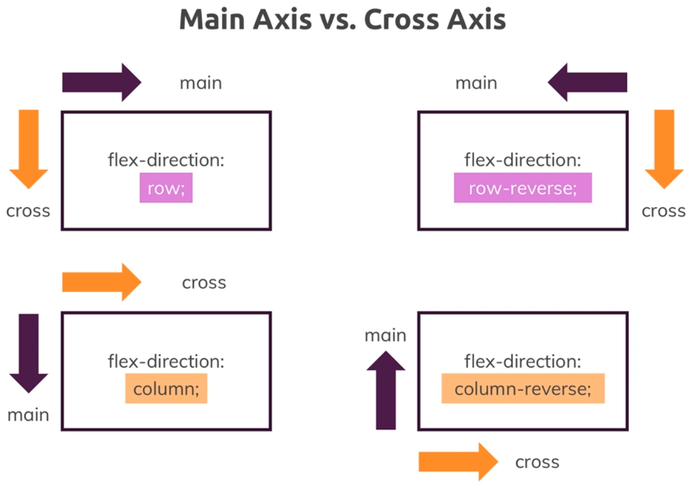
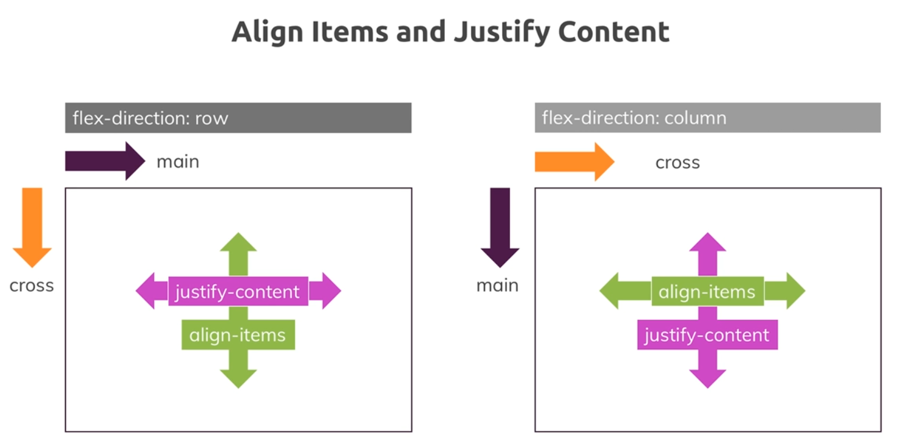

These are my notes from the course, https://www.udemy.com/course/css-the-complete-guide-incl-flexbox-grid-sass/

Content is roughly chronological based on the course sections, although sometimes I'll go back an update a previous section with new knowledge or to clarify a point.

Look for `KLUGE` in the source code for useful hacks.

# Fonts
- Serif: extending features at the end of strokes

# DevTools Styles tab
Styles are listed from most specific (top) to least specific (bottom).

Click on keyword "inherited" to see the true value, which can include ~~value~~.

# Naming Conventions
Look into `B.E.M.` aka `block, element, modifier`

Format is: `<block>__<element>--<modifier>`

Example:
```
  plan__item--highlighted

  /* plan is the logical container
     item is the element
     highlighted is the modifier
  */
```

# Selectors

## Universal 
```
<style>
  * { ... }
<style>
```

## Element
```
<style>
  body { ... }
<style>
...
<body>
...
</body>
```

## Class
```
<style>
  .post { ... }
</style>
...
<body>
  <p class="post">...</p>
</body>
```
 
## Attribute
 ```
 <style>
  [disabled] { ... }
</style>
...
<form>
  <button disabled>...</button>
</form>
 ```

 There are many more options here, go read https://developer.mozilla.org/en-US/docs/Web/CSS/Attribute_selectors#syntax. 

## ID
 ```
 <style>
  #name-input { ... }
</style>
...
<form>
  <input id="name-input">
</form>
 ```

# Combinators
## Adjacent Sibling aka Next Sibling
* Elements share the same parent.
* Second element comes __immediately__ after first element.

```
<style>
  h2 + p { 
    color: red;
  }
<style>

<div>
  <h2>Not applied</h2>
  <p>CSS applied</p>
  <h2>Not applied</h2>
  <h3>Not applied</h3>
  <p>Not applied</p>
  <h2>Not applied</h2>
  <p>CSS applied</p>
</div>
```
## General Sibling aka Subsequent Sibling
This is more flexible than _Adjacent Sibling_.

* Elements share the same parent
* Second elements comes after first element

```
<style>
  h2 ~ p { 
    color: red;
  }
<style>

<div>
  <h2>Not applied</h2>
  <p>CSS applied</p>
  <h2>Not applied</h2>
  <h3>Not applied</h3>
  <p>CSS applied</p>
</div>
```

## Child
* Second element is a _direct child_ of first element.

```
<style>
  div > p { 
    color: red;
  }
<style>
<div>
  <div>Not applied</div>
  <p>CSS applied</p>
  <div>Not applied</div>
  <article>
    <p>Not applied</p>
  </article>
  <p>CSS applied</p>
</div>
```

## Descendant
* Second element is a descendant of the first element.

```
<style>
  div p { 
    color: red;
  }
<style>

<div>
  <div>Not applied</div>
  <p>CSS applied</p>
  <div>Not applied</div>
  <article>
    <p>CSS applied</p>
  </article>
  <p>CSS applied</p>
</div>
```

# Specificity of Selectors
TODO: need to make sure this is correct

1. `!important`
1. inline style (labeled `element.style` in devtools)
1. `#ID`
1. `.class`, `:pseudo-class` and `[attribute]`
1. `<element>` and ::pseudo-element, `*` selector, browser defaults
1. inherited styles

__TODO: Where do combinators (Eg multiple selectors) go in this list?__

Conflicts are resolved by looking at the order in file, where last style wins.  Eg if you an element has both a `.class` and an `[attribute]` with styles, then the last one in the file will win.

# Performance
* ID selector and class selector 
* ... 
* certain combinators? (TODO: clarify)
* `*` selector

# Box Model
From inside to outside:
* `content` - the data to display within an HTML element.
* `padding` - "inside" space between the data and the element border.
* `border` - surrounds an element
* `margin` - "outside" space between the element and the rest of the DOM.

There is also `outline`:
* Comes after `border`.
* Does not affect box size.
* Does not affect box shadow.

# Margin Collapsing
  The top and bottom margins of blocks are sometimes combined (collapsed) into a single margin whose size is the largest of the individual margins (or just one of them, if they are equal), a behavior known as margin collapsing. Note that the margins of floating and absolutely positioned elements never collapse.

From https://developer.mozilla.org/en-US/docs/Web/CSS/CSS_box_model/Mastering_margin_collapsing

__NOTE__ Margins don't collapse in a container with display set to flex or grid.

# Shorthand properties
* Border: width style color, Eg 2px dashed orange
* Margin: top right bottom left, Eg 5px 10px 5px 10px 
* Margin: top & bottom left & right, Eg 5px 10px
* Margin: all, Eg 8px

# Height and Width
Pixel values are aboslute and do not depend on the parent element.

_Percentage_ values are based on the space within the parent element.  Many elements will be sized based on their content.  That leads to a width or height of 100% having no effect.

To make things take up more height, you must size from the top HTML element all the way down to the target element.
```
  <html style="height: 100%;">
    <body style="height: 100%;">
      <main style="height: 100%;">
        <!-- this will be 100% of page -->
        <div style="height: 100%;">
```

# Box Sizing
By default, Height and Width set the dimensions of the content, with padding, border and margin being additive to the total size of the area.  This is called _content_box_ sizing.

You can change this via `box-sizing` style. 

# Display Property
* none: element is not visible but present in the DOM.  It does not block a position in the layout.
* block
* inline
* inline-block: render like an inline element (Ie renders next to adjacent elements) with additional box properties like x-top, x-bottom and width, height available. TODO: confirm all box properties are true.

There is also `visibility: none` which will hide the element but the element will continue to block it's position in the layout.

**Inline Block is sensative to whitespace in HTML source** 

# Pseudo Things
Classes - `:class_name` - define a style for a _specific state_ of an element, Eg hover, read-only, first-child, not.
Element - `::element_name` - define a style for a _specific part_ of an element, Eg before, after, first-letter.  [Pseudo-elements act as if you had added a whole new element to the DOM, and enable you to style that.](https://developer.mozilla.org/en-US/docs/Learn_web_development/Core/Styling_basics/Pseudo_classes_and_elements#summary)

# Tricks
* Set all parent elements to `height: 100%;` to allow child element to have a specific height.
* Use `vertical-align: middle` to center content vertically.
* Set left/right margin to auto `margin: 0 auto;` and `text-align: center` to center an element horizontally.  This does not work for vertical alignment.
* Create circle by setting `height` and `width` to the same value and `border-radius: 50%`

# Positioning
Applies to block and inline elements.

How should the element be positioned Aka __Position Context__
* static (default)
* absolute
* relative
* fixed
* sticky

Where should the element be placed relative to the position context
* top
* right
* bottom
* left

__Note__: top/right/bottom/left will only have effect when the position property is set to a non-default value (Ie not `static`).

### Fixed
Element is taken out of the document flow.

* Without top/right/bottom/left the position context is the parent element.
* With top/right/bottom/left the position context is the _viewport_.

### Absolute
Element is taken out of the document flow.

* If no ancestors have a position applied, then the position context is the `<html>` element.
* If ancestors have a position applied, then the position context is the _closest ancestor with a position property_.

### Relative
Element remains in the document flow.

* Positioning context is the _element_ itself.
* Top/right/bottom/left adjusts relative to element's current position.

__Problem__: You can move the element outside of it's parent element.  Use `overflow: hidden;` in the parent element to ensure the element is not displayed when it goes outside the bounds of parent.  __Caveat__: you cannot apply `overflow: hidden;` to `<body>` as the default behavior in CSS says that it will instead be applied to `<html>`, which will ensure any child-elements of body will NOT be hidden.  To get around this: apply `overflow: hidden;` or `overflow: auto;` to `<html>` and apply `overflow: hidden;` to `<body>`.

### Sticky
* The element starts as `relative` when there are no distances set.
* If you set a distance then the position context is either the _viewport_ or _another element_.  Once the distance is reached, the element behaves as `fixed`.
* If the element goes outside of its parent content area then it becomes hidden.

From MDN: ... a sticky element "sticks" to its nearest ancestor that has a "scrolling mechanism" (created when `overflow` is `hidden`, `scroll`, `auto`, or `overlay`), even if that ancestor isn't the nearest actually scrolling ancestor.

__TODO__ need more details here.  Course coverage not great.

## z-index
* default value is `auto` which is equal to `0`.
* Will not take effect unless you've changed `position` property to a non-default value (Ie not `static`) __unless__ you are using flexbox.
* When there are multiple elements with same z-index, the last element in the HTML source file wins and is displayed above the other elements.

## Stacking Context
Each z-index is evaluated within a `stacking context`.  By default the root element (`<html>`) establishes the initial stacking context.

A stacking context is defined by any element:
* element with position of `absolute` or `relative` and a `z-index` value other than `auto`.
* element with position of `fixed` or `sticky`.

The stacking context is used to evaulate z-index values of all child elements relative to each other.

In this example, `headline` has a z-index value, and `image-2` has a z-index value.  `image-2` cannot be below `headline` or above `contact-us` without making adjustments to its parent z-index value first.



# Backgrounds & Images

## background-size

`background-size: <height> <width>;` where height and width are:
* auto
* px
* %

`background-size: <keyword>;` where keyword is:
* cover - Scales the image (while preserving its ratio) to the smallest possible size to fill the container (that is: both its height and width completely cover the container), leaving no empty space.
* contain - Scales the image as large as possible within its container without cropping or stretching the image.

## background-position
For an image that does not fit into it's container, position defines where the cropping will occur.

`background-position: <x offset> <y offset>;` where offset
* px
* % - determines where to crop the image.  A value of `top = 50%` means that top and bottom will be cropped equally. Read more at https://developer.mozilla.org/en-US/docs/Web/CSS/background-position#regarding_percentages
* position keywords - center (sames as `50% 50%`) or left top (same as `0% 0%`)
* position and % or px values - Eg `left 10% bottom 20%`

X is evaluated relative to left and Y is evaluated relative to top.

## background-origin

Like box-sizing. TODO: more details

## background-clip

Overwrites background-origin. TODO: more details.

## background-attachment

Defines how image attaches (and scrolls) to the container or viewport.
 
Not used often.

## background shorthand

```
/*          image              position           /size  repeat    origin clip  */
background: url("freedom.jpg") left 10% bottom 20%/cover no-repeat border-box   ;
```

When a single value is used in the `origin clip` position then it's used for both properties as shown in the example above.

## images

* By default, the dimensions of the image will be used to render the image regardless of its parent element.
* __KEY__ If the parent element is an inline element, then using percent values for image height/width will have the same behavior (Ie ignored).  THe parent element dimensions are used.
* __KEY__ If the parent element is a block or inline-block element, then the parent container size controls the image size.


Position and sizing of an img is not as flexible as background-image, but background-image should only be used for 'background' images due to accessibilty concerns.


# box-shadow
Args:
* X
* Y
* blue
* spread
* color
  * rgb and the 4th value is opacity

```
/*          X     Y     blur  spread   color                    */
box-shadow: 2px   2px   2px    2px   rgba(0, 0, 0, 0.5);
/*                                                   ^opacity   */
```

See https://developer.mozilla.org/en-US/docs/Web/CSS/CSS_backgrounds_and_borders/Box-shadow_generator

# Gradients
* Gradients are treated as images.
* My notes are light - read MDN instead if you need it.

## Linear
* Use builtin `linear-gradient()` function.

Examples:
```
  background-image: linear-gradient(30deg, red, blue);
  background-image: linear-gradient(to left bottom, red, blue);
  background-image: linear-gradient(180deg, red, blue, green, yellow, orange);
  background-image: linear-gradient(360deg, red, transparent);
  /*                                        red ends after 70% */
  background-image: linear-gradient(180deg, red 70%, blue, grey);
  /*                                        blue ends after 80% */
  background-image: linear-gradient(180deg, red 70%, blue 80%, grey);
  /*                                        blue ends after 60% which makes a hard edge */
  background-image: linear-gradient(180deg, red 70%, blue 60%, grey);
```

* Elipse can have it's size (width, height) adjusted.  See circle examples.

## Radial
* Use builtin `radial-gradient()` function.
* by default, makes ellipse.  use optional first arg to make a circle.

Examples:
```
  background-image: radial-gradient(red, blue);
  background-image: radial-gradient(red, blue, green);
  /*                                shape                         */
  background-image: radial-gradient(circle, red, blue, green);
  /*                                          shape start 'at top'
                                               v                  */
  background-image: radial-gradient(circle at top, red, blue, green);
  /*                                ditto      X  Y               */
  background-image: radial-gradient(circle at 20% 50%, red, blue, green);
  /*                                       size                   */
  background-image: radial-gradient(circle 20px at 20% 50%, red, blue, green);
```

## Stacking Backgrounds
* Only 1 background-color can be used.  It will be last one listed in the style.
* Multiple background-image styles can be used.

# Filter
* grayscale()

 

# SVG
* You can style the individual components of an SVG image with properties such as `stroke` and `stroke-width`.

# Sizes & Units

__Units__
* pixels - `px`
* percentages - `%`
* root em - `rem`
* em - `em`
* viewport height - `vh`
* viewport width - `vw`

__Questions__
* What properties can I use with these units?
  * font-size
  * padding
  * border
  * margin
  * width, height
  * top, right, bottom, left
* How is the size calculated?
  * absolute lengths - mostly ignore user settings, `px`
  * viewport lengths - adjust to current viewport, `vh`, `vw`, `vmin`, `vmax`
  * font-relative lengths - adjust to the default font size, `rem`, `em`
  * percentages - remember these 3 rules: 
    * `position: fixed` - containing element is the viewport.  Size is % of viewport.
    * `position: absolute` - containing element is the closest ancestor with explicit position != static.  Size is % of _element content + padding_.  If there is no ancestor then viewport is used.
    * `position: static`, `position: relative` - containing element is the closest ancestor that is a _block level_ element.  Size is % of _element content_.  __There is unexpected behavior when settings height % in this case__
* What's the right unit to choose?
  * font-size (root element aka `<html>`) - `%`
  * font-size - `rem`, or `em` for children only.
  * padding, marging - `rem`
  * border - `px`, keep it fixed because you don't want a 30px if it's using `rem`
  * width, height - `%` or `vw`/`vh`, make the element size relative to something else.
  * min-width, max-height, etc - `%` or `vw`/`vh`, ditto.
  * top, right, bottom, left - `%`, ditto.

## REM vs EM
* EM - font size is based on current element _and_ ancestors.  This can lead to unexpected sizes.
* REM - font size is based on root element font size.

Rules of thumb:
* Prefer REM over EM
* Use REM for fonts, padding, margins.
* Use absolute for shadows and borders.


## Viewport Units
* vh - viewport height
* vw - viewport width
* vmin - smallest component of viewport (either height or width)
* vmax - largest component of viewport (either height or width)


Syntax:
```
width: 80vw;     /* numbers are % of viewport */
height: 100vh;
```

__BUG__: After adding vw, you probably saw that the scrollbars appeared in case you are working on Windows.  This happens as using vw on Windows does not include the scrollbars - `vw100`  is  equal to `100%` of the viewport width + the scrollbars.

## Auto
* works for block level elements with an explicitly assigned width
* easy way to center elements.  See main.css, `.plan__articles `

# Style with Javascript
* Access `inline` styles using the `style` DOM element property.
* Use `className` or `classList` DOM element property.  Use `classList` to easily add/remove a single class. 

# Responsive Design

## Viewport meta tag
* `width` - adjust site to device viewport; translate hardware pixesl into css software pixels.
* `initial-scale` - initial zoom level. 1.0 is default.
* `user-scalable` - can the user zoom in/out of your site?  Defaults to yes.
* `maximum-scale` - limit zoom out level.
* `minimum-scale` - limit zoom in level.

## Media Queries
* Change design depending on size and orientation.
* It's important to order media queries based on width conditions; last true expression wins.
```
/* do this */
@media (min-width: 40rem) { ... }
@media (min-width: 60rem) { ... }

/* don't do this, second rule always wins */
@media (min-width: 60rem) { ... }
@media (min-width: 40rem) { ... }
```

You can combine multiple queries with `and` or with `,` (aka `or`):
```
/* all conditions must match */
@media (min-width: 40rem) and (min-height: 60rem) { ... }

/* at least one condition must match */
@media (min-width: 40rem), (orientation: portrait) { ... }
```

# Styling Forms
* Many form elements have default browser styles that you will want to override.  Use `inherit` keyword for that.
* Use `:focus` pseudo selector to provide feedback.
* `outline` is helpful when styling form elements.  It's different than `border`.
* For validation - use `:valid` and `:invalid` pseudo selectors along with `invalid`, `disabled` and `required` element attributes.
* Styling `select` form element requires extra work.  See https://stackoverflow.com/questions/1895476/how-do-i-style-a-select-dropdown-with-only-css

# Text and Fonts
TBD

# Flexbox
* Allows you to get rid of `display: inline-block`
* Allows us to change the way our elements are displayed.
* `display: flex` creates a flex container. A container contains children aka `flex items`.
* You can apply properties to the flex container and the flex items.
  * for the container: `flex-flow:`, `justify-content:`, `align-content:`, `align-items:`
  * for the items: `order:`, `flex:`, `align-self:`

## Flex Container
* `display: flex`, `display: inline-flex` - create a container.
* `flex-direction: row` - create rows of items.  The height of each row is based on the flex items in said row.  Items will take only the space needed.
* `flex-direction: column` - create columns of items.  The width of each column is based the flex items in said column.  Items will take only the space needed.
* `flex-wrap: nowrap` - do not wrap the flex items to a new row.
* `flex-wrap: wrap` - wrap the contents.
* "reverse" values are available for `wrap`, `column` and `row` and will change location and direction of the axis pair.
* `flex-flow` is shorthand for `flex-direction` and `flex-wrap`.  It looks like `flex-flow: row wrap;`.

## Main Axis vs. Cross Axis
Content is rendered on the `main` axis to start and moves to the `cross` axis when wrapping occurs.



## Alignment
`align-items` property aligns flex items along the `cross` axis.
`justify-content` property aligns flex items along the `main` axis.
`align-content` property sets the distribution of space between and around flex items along the `cross` axis. [source](https://developer.mozilla.org/en-US/docs/Web/CSS/align-content)



## Flex Items
* `order: <n>` - change order of flex item within the flex container, relative to `main` axis.  By default `order` is `0`.
* `align-self` - change position of flex item relative to `cross` axis.  The property values are the same as `align-items`.
* `flex-grow` - change growth factor of flex item.  By default `flex-grow` is `0`. When `wrap` is enabled, a flex item with `flex-grow > 0` will consume the entire space.
* `flex-shrink` - like grow but for shrinking. Default value is `1` which means element can shrink.  Use `0` to prevent shrink or `>1` to increase ratio that element shrinks.
* `flex-basis:<size>` - change size of a flex item depending on orientation of the `main` axis. Eg `row` will adjust `width` and `column` will adjust `height`.  The `auto` value maps to a defined `width` or `height` value on the element.  Percentage values of flex-basis are resolved against the flex container. [source](https://developer.mozilla.org/en-US/docs/Web/CSS/flex-basis)
* `flex:` - is shorthand for `<grow> <shrink> <basis>`

# CSS Grid
Use firefox devtools, _still_ better than Chrome devtools.

* Controls a grid in two dimensions
* Use `display: grid` to create a grid container
* _By default_ all child elements are put into autogenerated rows in the grid.  The rows are sized based on the content.  You can override that behavior with `grid-auto-flow: column;` to autogenerat columns instead.

## Grid Definition
Use `grid-template-columns: 200px 2fr 20% 1fr` to define columns and `grid-template-rows` to define rows.  You can supply these units:
* absolute `px`
* relative `%`
* ratio `fr` (fraction), just like `flex-grow` and `flex-shrink`
* `auto` to take remaining area
* `fit-content(<size>)` defines the minimum size for the content.  Size is %, px, rem. 
* `repeat(<n>, <unit>)` repeat the `<unit>` value `<n>` times. Eg `repeat(4, 25%)`.
* `minmax(<min>, <max>)` min and max values for the area.
* You can provide a `name` for each row/column like so: `grid-template-row: [row-one row-uno] 200px`. Row 1 can now be referred to via `row-one` or `row-uno` in grid start/end statements.  These names do _not_ appear in devtools.
* You can provide a `name` in the `repeat` statement as well, `grid-template-columns: repeat(4, [col-start] 25% [col-end]);`.  This will produce 3 columns, each one with the same name `col-start` and `col-end`.  To reference the name later, use syntax `column-start: col-start <n>` where `<n>` is the number of the column.
* If you provide a `name` in the format: `xxx-start` or `xxx-end` then named grid will automagically be generated for you.  This was covered in section 14.226 but I'm not sure I really follow it.

## Grid Content Controls
These properties are defined on the grid container.

* Use `grid-xxx-gap` to adjust the gap between rows and columns of the grid.
* Use `justify-items` to align grid items in the row and `align-items` to align grid items in the column.  Possible values are:
  * `stretch` (default)
  * `start`
  * `end` 
  * `center`
* Use `justify-content` to position the grid itself within it's container on the X axis and use `align-content` to position the grid on the Y axis.  Possible values are:
  * `stretch` (default)
  * `start`
  * `end`
  * `center`

### Responsive Design
These properties are defined on the grid container.
* Use `grid-auto-flow: <xxx>` to set if `row`s or `column`s are auto-generated.  Add the additional keyword `dense` to ensure empty spaces are filled up. Eg `grid-auto-flow: row dense;`. __Using dense is not good for accessibility and screen readers__
* Use `grid-auto-xxx` to style the auto-generated rows and columns.
* Modify your `grid-template-rows` and `grid-template-columns` to use `auto-fill` in the `<n>` slot. Grid items will wrap to the next row/column.  You can use `auto-fit` if you think you might have too _few_ grid items, in which case the content will be centered in the row/column while also wrapping when there are too many items.

## Child Element Controls
On the child elements, use `grid-xxx-start` and `grid-xxx-end` to adjust the rows and columns.  The units are:
* `<n>` - an explict row or column line number.  Enable `Display line numbers` in devtools to see the numbers.  Negative values are also supported.  `+1` is the start of a row or column, while `-1` is always the end of row or column.
* `span <n>` - span explicit amount of rows or columns.
* overlap in elements is avoided by default but you can force overlap via start/end combinations.  The order in the DOM determines which element is on top, with last element being on top.  You can use `z-index` to change that behavior.

You can adjust child content using `justify-self` (along X axis) and `align-self` along the Y-axix.  These values will override `justify-items` and `align-items` defined on the grid.  Possible values are:
* `stretch` (default)
* `start`
* `end`
* `center`

You can adjust gaps with `grid-row-gap` and `grid-column-gap`. 

## Shorthand notation
* `grid-column: <start> / <end>`
* `grid-area:  <row-start> / <col-start> / <row-end> / <col-end>`
* `grid-gap: <row-gap> <col-gap>` - _note_ there is no forward slash in the value.

## Grid Area
Grid area allows you to replace references to explicit row/col values (via `grid-xxx-start` and `grid-xxx-end`) with named areas.

In a grid with 4 columns and 3 rows, you can define named areas with this syntax:
```
.container { 
  
  grid-template-areas: "header header header header" 
                       ". . main main"
                       "footer footer footer footer";

}
```

Then map the item onto the area:
```
.item {
  grid-area: main
}
```

* __NOTE__: DOM order is not used to resolve conflicts (like with grid start/end) when laying out elements using `grid-area`.

You can make a grid responsive by using media queries and changing the named grid areas accordingly.

## Relation to `position`

Elements that are not part of the document flow (Ie `fixed` and `absolute`) are not part of the grid.

# Naming CSS Classes
* Use `kebab-case`.  CSS is _case-insensitive_.
* Name classes by feature, Eg `.page-title`
* Use Block Element Modifier (BEM). 
  * `.<block>__<element>--<modifier>`
  * `.menu-main__item--size-big`
  * `.button--success`

# ------------- NOTES BELOW, NOT FROM THE COURSE -------------

# CSS Variables
Variables _are_ case-sensitive, so stick with `kebab-case` as with classes.
Example:
```
:root {
    --main-color: #06c;
}

#foo h1 {
    color: var(--main-color);
}
```
